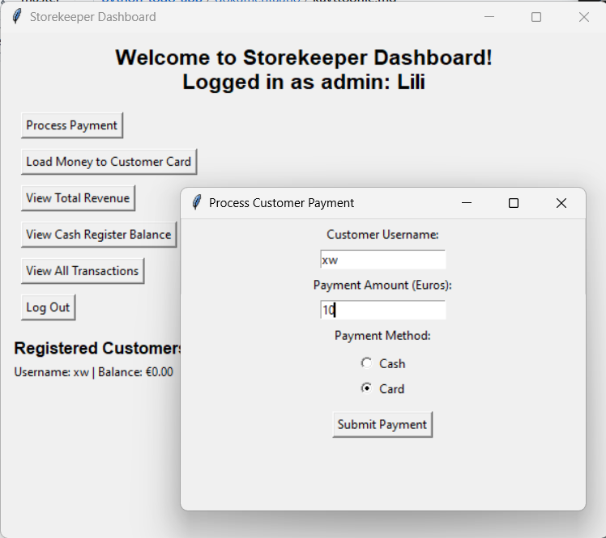

# Instructions for use

Download the source code from the latest [Week 7 Final release](https://github.com/xiongxiaowen/ot-harjoitustyo/releases) of the project by selecting _Source code_ under the _Assets_ section.

Note: This program was developed on Windows, all commands mentioned in this program is based on Windows. Please use Linux command line if run on Linux. Program was tested every week on Omnissa Horizon Client, program can open and work well with Cubbli Linux.

**Starting the program & Configuration**
Before starting the program, install the dependencies with the command: 
- poetry install

After which, perform the database initialization steps with the command(ensure DB & tables created successfully):
- poetry run invoke build

Then start the program with the command:
- poetry run invoke start

**Login & Creating a new user**
The application starts in the home page login view:

Customer login to the application as a customer role. A storekeeper login as a storepeeker role, which allows to access data and operations as a admin for all registered customers, e.g. view registered customer list and customer's current balance; process payment, load money to customer card, view total revenue including both card and cash payment types; view cash balance (revenue via cash payment); view all customer transactions.

User name is always unique, once created either with customer or storekeeper role, the user name and role is binded. System will allow log in per the created role no matter which role selected (selecting the wrong role won't impact on loging in), and system does not allow to create another account using the same name, not allow users to change the registered role. Therefore, customer and storekeeper admin roles are isolated. Customer will not be able to process storekeeper's operations.

- After successful regisration and login, below customer dashboard appears.

- After successful regiration and login, below storekeeper dashboard appears. 

**Customer's dashboard functions**
- Customer can modify own profile (password) by typing new password and clicking the button of Update Password. Then a pop up small window with message tells the updating is successful. The modified password works as new valid password in next login. 

- Customer can view/check the balance aftering loading money to the payment card at store (initial balance 0), loading operation by storepeeker.
- Customer can pay purchases at store by using the payment card or cash. benefit 10% discount if pay by membership payment card, balance will be reduced after transaction.
- Customer can view transaction history(timestamp, amount and payment type). 

- Customer can log out by clicking the button of log out. 
- Customer can delete own account if quit from the membership card by clicking the button of delete.

**Storekeeper's dashboard functions**
- view registered customer list and customer's current balance (The list under the log out button); 
- process payment: receive the payment via the payment card or cash. Apply discounts for customers during card transactions. No discounts if payment type is cash. Transaction will be declined, if no sufficient money in card.

- load money to customer card.After successful loading, a pop up window with messages tells how much has been loaded to which customer. 

- view total revenue including both card and cash payment types; 

- view cash balance (revenue via cash payment); 

- view all customer transactions.

In the example, user xw got card loaded with 100€ by storekeeper, transactions of payment in cash 10€ and paid with card 9€ after discount (10€ before discount 10%) are listed in the Transactions list for storekeeper. User xw's card balance is 100-9= 91€, which is visible for storekeeper.

- can log out by clicking the button of log out.
