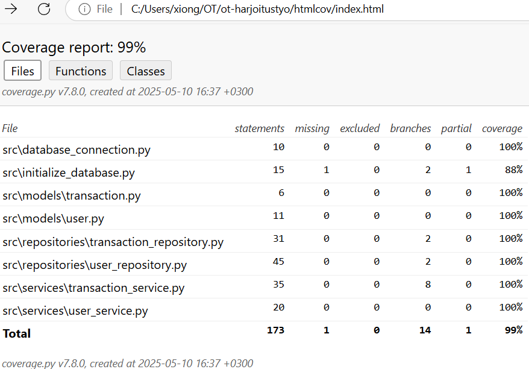

# Testing Document
The program has been tested with both unit and integration tests, as well as manual system level tests.

## Unit and integration testing

### Application logic
The two classes of service in services subfolder are responsible for the application logic to complete operations, are tested with the TestTransactionService and TestUserService test classes. 

The TransactionService class processes all transaction business logics, and the UserService class handles user related operations. Testing used mocked repository bypass the DB, no need to interact with the actual production data in DB, to ensure tests are fast and reliable in unit testing. 

### Repository classes
The repository classes TransactionRepository and UserRepository are tested with TestTransactionRepository and TestUserRepository classes. Target is to ensure well-structured and efficient testing codes, so in memory SQLite is used.  

### Testing coverage
The application is able to generate a test coverage report. Test Coverage report can be generated with the command:
- poetry run invoke coverage-report (The html report will be generated in the htmlcov directory)
- poetry run coverage html (view HTML report via link)

User interface and tests codes are left outside the test coverage report, the branch coverage of the application testing is 99%. The .coveragerc file specifies which directory the test coverage is collected from.

## Application testing
The system testing of the application has been performed manually.

### Installation and configuration
The application was developed on Windows and was tested every week on Omnissa Horizon Client with Cubbli Linux. Program can open and work well with Cubbli Linux. 

The application was tested in situations where users and transactions are existing and also in situations with edge cases where users and transactions are not existing.

Before starting the program, install the dependencies with the command: 
- poetry install

After which, perform the database initialization steps with the command:
- poetry run invoke build (you will see the printout "Database initialized" if DB and tables created successfully in command line)

Then start the program with the command:
- poetry run invoke start (application's login view window opens after this command)

### Functionality
All functionalities listed in the specification document and user instructions have been implemented and reviewed. All functions are working correctly according to specification and business logics. 