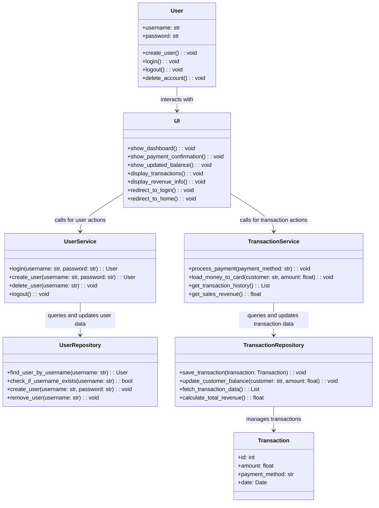
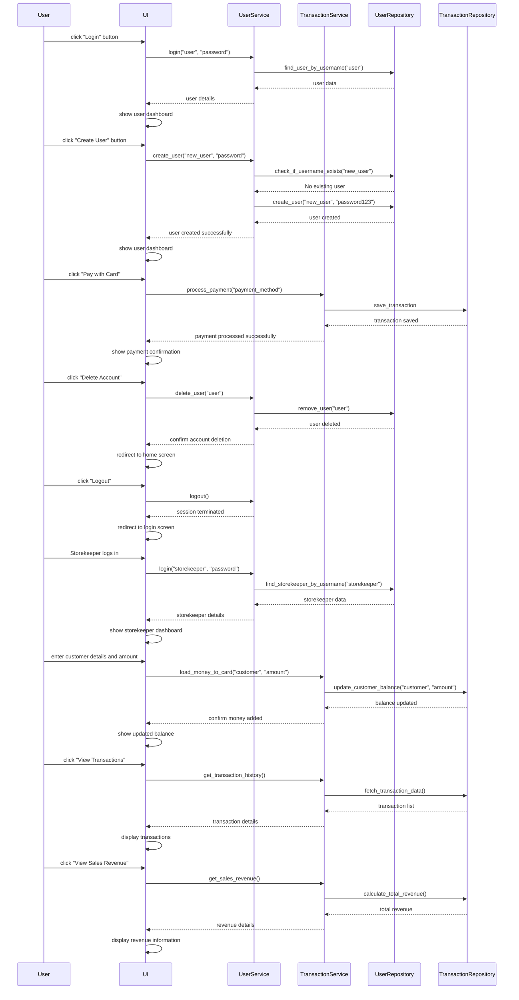

# Architecture Description

## Structure

The program structure follows a three-tier layered architecture, and the code packaging structure is as follows: 
/ membership_card_system 
&ensp;/ui (User Interface components) 
&ensp;/ services       (Application logic to complete operations) 
&ensp;/ repositories   (Data storage) 
&ensp;/ entities       (Core domain class) 
    

The ui package contains the user interface logic, services handle business operation logic, and repositories manage data storage. The entities package defines core data structures used throughout the application.

## User Interface
The UI consists of separate views for customers and storekeepers:
- Customer UI:
    - View profile
    - Check payment balance
    - View transaction history

- Storekeeper UI:
    - View profile
    - Check cash register balance
    - View transaction amounts and sales revenue

The UI interacts with services module's classes to handle business logic.

## Application Logic
Class diagram below illustrates the application logic.

Sequence diagram below

## Data storage

## Files

## Core Functionalities

