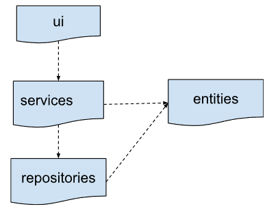

# Architecture Description

## Structure

The program structure follows a three-tier layered architecture, and the code packaging structure is as follows:<br>
/ membership_card_system<br>
&ensp;/ui (User Interface components)<br>
&ensp;/ services       (Application logic to complete operations)<br>
&ensp;/ repositories   (Data storage)<br>
&ensp;/ entities       (Core domain class)<br>
    



The ui package contains the user interface logic, services handle business operation logic, and repositories manage data storage. The entities package defines core data structures used throughout the application.

## User Interface
The UI consists of separate views for customers and storekeepers:
- Customer UI:
    - View profile
    - Check payment balance
    - View transaction history

- Storekeeper UI:
    - View profile
    - Check cash register balance
    - View transaction history and sales revenue


The UI interacts with services module's classes to handle business logic.

## Application Logic
Class diagram below illustrates the application logic.


Sequence diagram below illustrates the core functionalities


## Data storage
Data is stored in SQLite database. Users and transactions are stored in the SQLite database tables users and transactions, which are initialized in the initialize_database.py file.

### Files
Files used to build up the program are structured as below

```
├── src/
│   ├── initialize_database.py        # Creates and setup initial database schema
│   ├── database_connection.py        # Manages connections to the database
│   │
│   ├── ui/                           # Contains all user interface components
│   │   ├── main_login_view.py        # Main login entry point
│   │   ├── customer_view.py          # Displays the customer interface
│   │   └── storekeeper_view.py       # Shows the storekeeper/admin interface
│   │
│   ├── models/                       # Defines data structures/entities
│   │   ├── user.py                   # User model definition
│   │   └── transaction.py            # Transaction model definition
│   │
│   ├── repositories/                 # Data layer, database operations
│   │   ├── user_repository.py        # Database storage for users
│   │   └── transaction_repository.py # Database storage for transactions
│   │
│   ├── services/                     # Contains business logic
│   │   ├── user_service.py           # User-related business operations
│   │   └── transaction_service.py    # Transaction processing operations
```

## Functionalities for future development (not in this course scope)
Based on business demand, it is possible to add below features to enrich the program: 
- Based on purchased value, classify customers into various classes or levels which entitle customer various discount. 
- Push discount or campaign notification from storekeeper to customer end based on customer class. 
- Fancy user interface can be possible if adding more colors or graphic design elements. 
- Customer dashboard to be integrated with bank account, allow customer load money online from bank to top up the memberhsip card, growing the balance as diposit. Balance is customer's asset.
- Allow customer bind bank card and credit card to memberhsip payment card application, for easier toping up and grow the balance.
- Add possible financial services for customer's balance: grant customer interests daily (reasonable interest rate) if balance reach a certain amount, e.g.>= 1k €.
- integrate with fund and stock sales service, allow customer to purchase and manage fund and stock market investments. 

