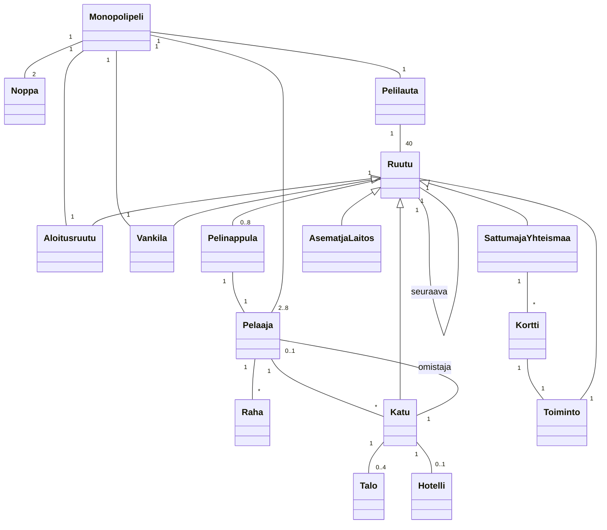

## Monopoli, laajennetaan alustavan luokkakaavion perusteella

```mermaid
classDiagram
    Monopolipeli "1" -- "2" Noppa
    Monopolipeli "1" -- "1" Pelilauta
    Monopolipeli "1" -- "1" Aloitusruutu
    Monopolipeli "1" -- "1" Vankila

    Pelilauta "1" -- "40" Ruutu
    Ruutu "1" -- "1" Ruutu : seuraava
    Ruutu "1" -- "0..8" Pelinappula
    Pelinappula "1" -- "1" Pelaaja
    Pelaaja "2..8" -- "1" Monopolipeli
    Pelaaja "1" -- "*" Raha
    Pelaaja "1" -- "*" Katu

    Katu "1" -- "0..4" Talo
    Katu "1" --"0..1" Hotelli
    Katu "1" -- "0..1" Pelaaja : omistaja

    Ruutu <|-- Aloitusruutu
    Ruutu <|-- Vankila
    Ruutu <|-- SattumajaYhteismaa
    Ruutu <|-- AsematjaLaitos
    Ruutu <|-- Katu

    SattumajaYhteismaa "1" --"*" Kortti
    Kortti "1" -- "1" Toiminto
    Ruutu "1" -- "1" Toiminto
```