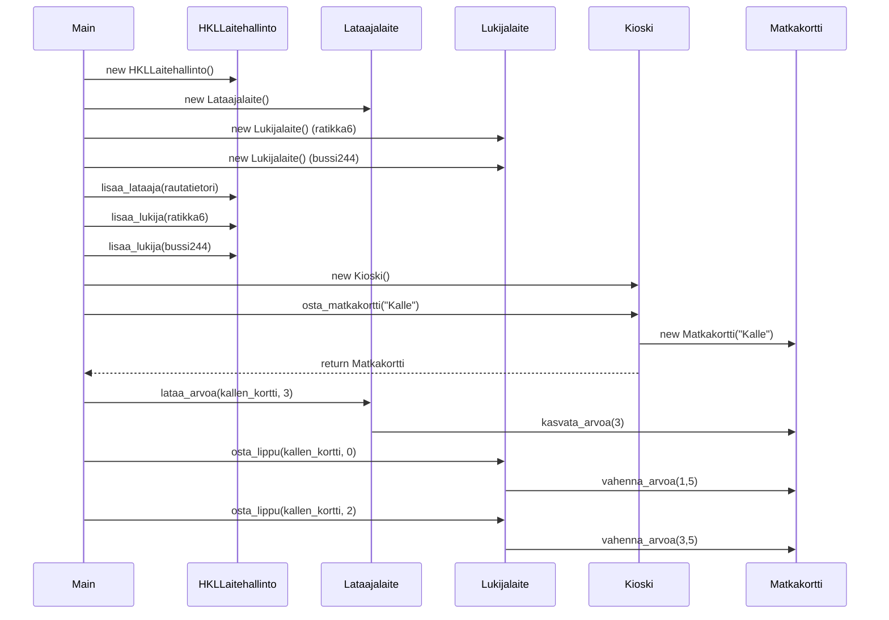

```mermaid
sequenceDiagram
    participant Main
    participant HKLLaitehallinto
    participant Lataajalaite
    participant Lukijalaite
    participant Kioski
    participant Matkakortti

    Main ->>HKLLaitehallinto: new HKLLaitehallinto()
    Main ->>Lataajalaite: new Lataajalaite()
    Main ->> Lukijalaite: new Lukijalaite() (ratikka6)
    Main ->> Lukijalaite: new Lukijalaite() (bussi244)
    Main->>HKLLaitehallinto: lisaa_lataaja(rautatietori)
    Main->>HKLLaitehallinto: lisaa_lukija(ratikka6)   
    Main->>HKLLaitehallinto: lisaa_lukija(bussi244)   
    
    Main ->> Kioski: new Kioski()
    Main ->> Kioski: osta_matkakortti("Kalle")
    Kioski->>Matkakortti: new Matkakortti("Kalle")
    Kioski-->>Main: return Matkakortti
    Main ->> Lataajalaite: lataa_arvoa(kallen_kortti, 3)
    Lataajalaite->>Matkakortti: kasvata_arvoa(3)

    Main ->> Lukijalaite: osta_lippu(kallen_kortti, 0)
    Lukijalaite ->> Matkakortti: vahenna_arvoa(1,5)

    Main ->> Lukijalaite: osta_lippu(kallen_kortti, 2)
    Lukijalaite ->> Matkakortti: vahenna_arvoa(3,5)
```